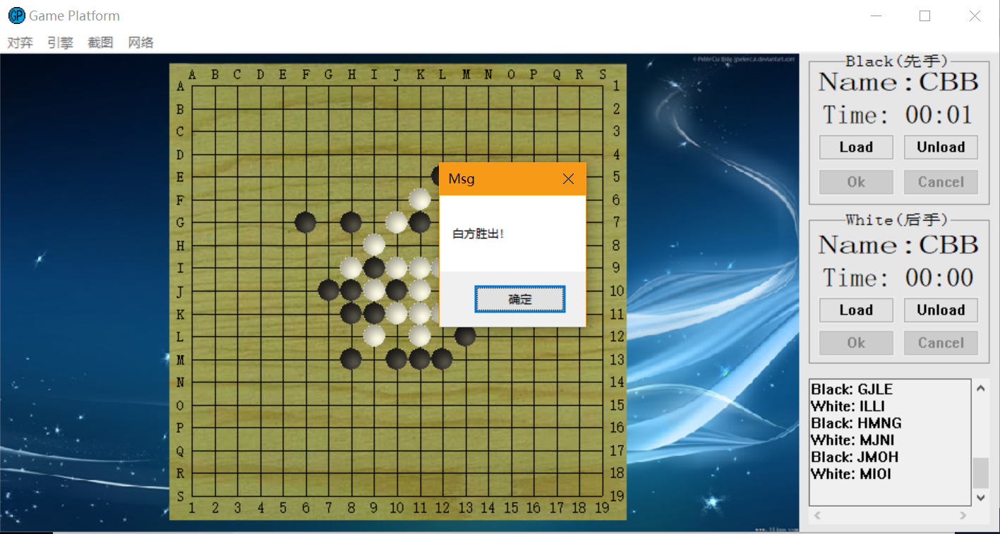

# Connect 6

Wrote an AI program to automatically play chess by C++ with people or programs written by others. Used the scanning method of partial “path” for step scoring, and used the game tree algorithm to ensure the center priority and limit tree width for further optimization. Enabled the program to make each move in less than five seconds to beat greedy algorithms. 

## Requirements

C++

## Getting Started

Run framework_program/chess.cpp and generate framework_program/chess.exe

Run SAU_Game_Platform_2.1.0_r4/SAU Game Platform.exe and select framework_program/chess.exe

## Preview

